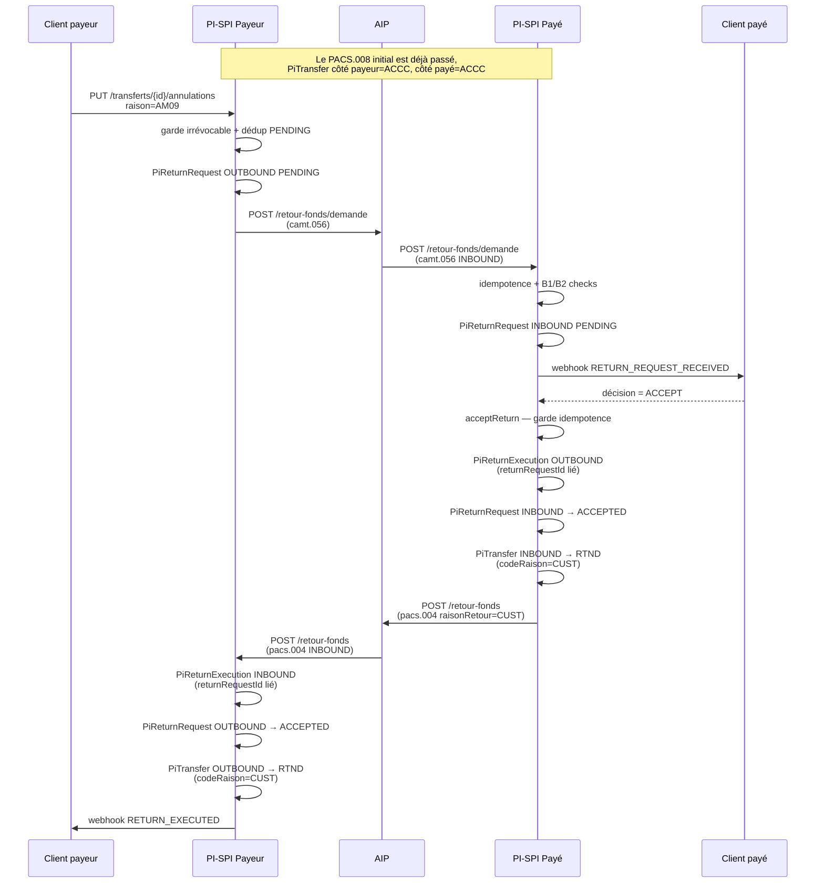
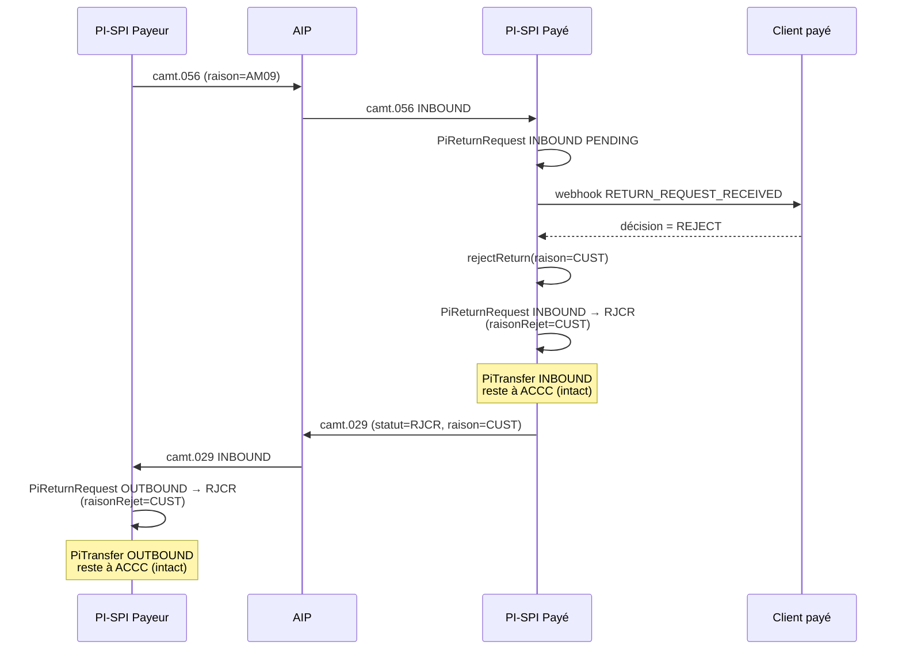
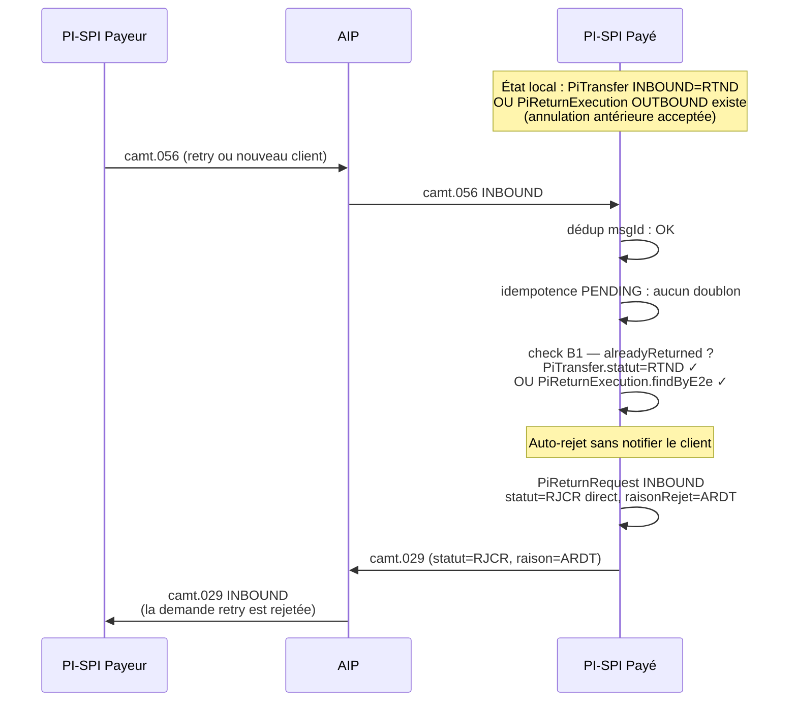
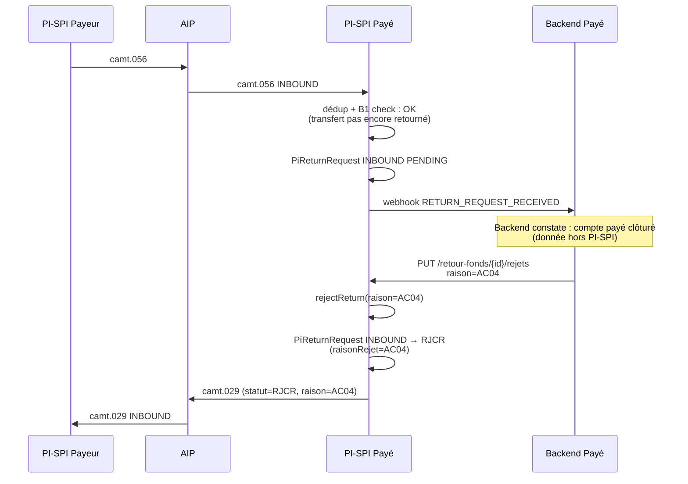
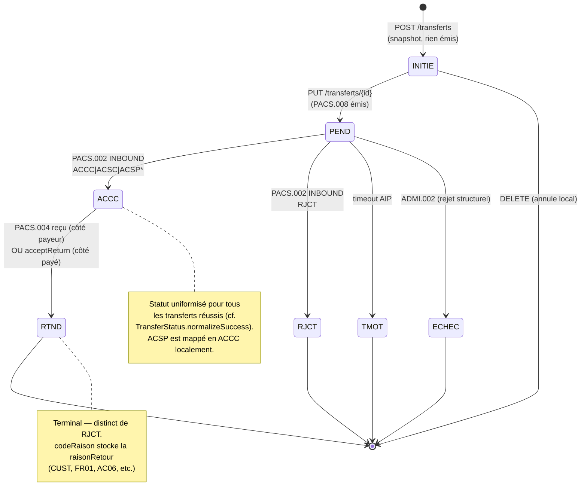
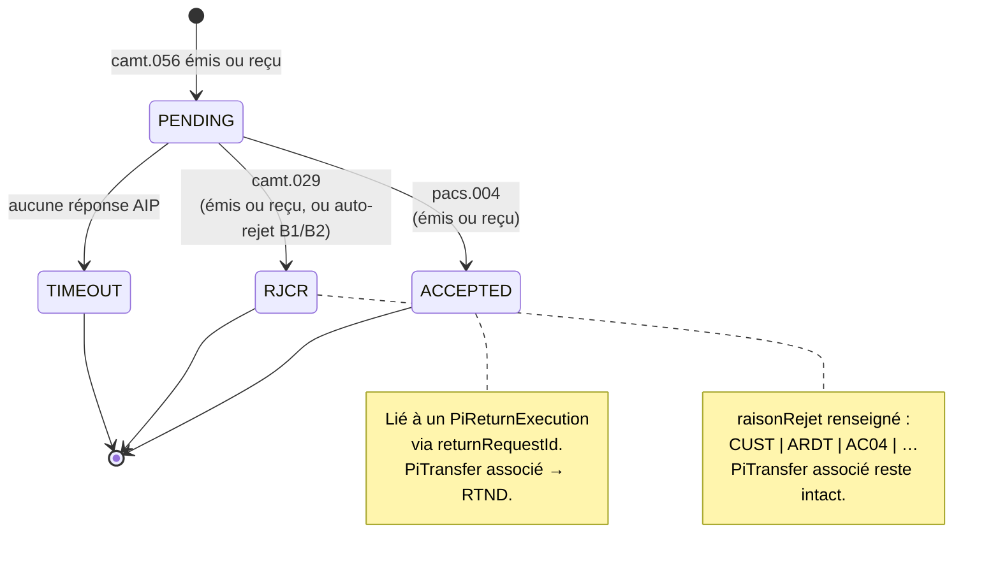
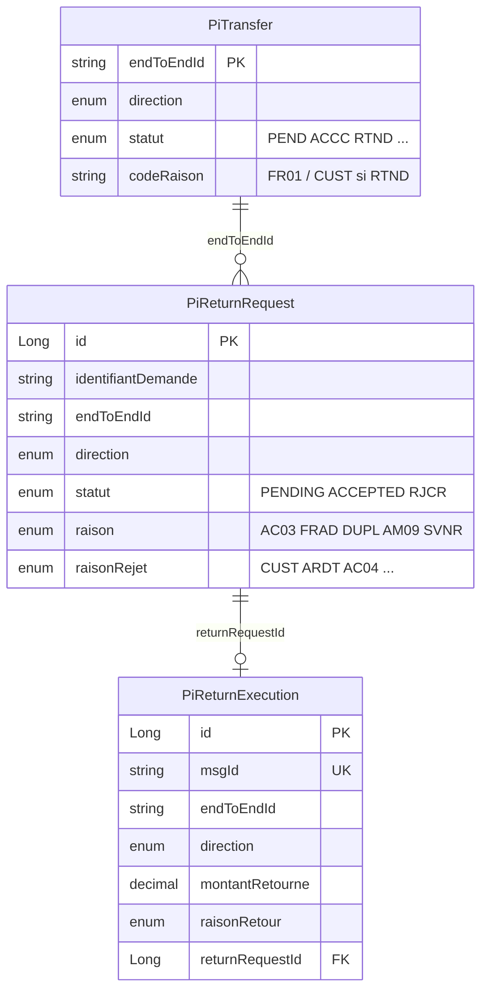

# Flux d'annulation — CAMT.056 / CAMT.029 / PACS.004

Documentation de référence pour le flux BCEAO §4.8 « Annulation d'un transfert ou d'un paiement ». Couvre les 3 messages ISO 20022, les 3 entités locales (`PiTransfer`, `PiReturnRequest`, `PiReturnExecution`), et les 3 scénarios BCEAO de traitement à la réception d'un camt.056.

---

## 1. Vue d'ensemble — entités vs messages

```mermaid
flowchart LR
    subgraph ISO[Messages ISO 20022]
      direction TB
      M008[PACS.008<br/>virement initial]
      M056[CAMT.056<br/>demande d'annulation]
      M029[CAMT.029<br/>rejet de la demande]
      M004[PACS.004<br/>retour de fonds effectif]
    end

    subgraph DB[Entités locales]
      direction TB
      T[PiTransfer<br/>statut: PEND→ACCC→RTND]
      R[PiReturnRequest<br/>statut: PENDING→ACCEPTED|RJCR]
      E[PiReturnExecution<br/>montantRetourne, raisonRetour]
    end

    M008 -.persist.-> T
    M056 -.persist.-> R
    M029 -.update statut.-> R
    M004 -.persist.-> E
    M004 -.update statut.-> T
    R -.returnRequestId.-> E
```

**Distinction clé** :
- `PiReturnRequest` = « quelqu'un *demande* l'annulation » — peut rester PENDING ou finir RJCR sans mouvement de fonds.
- `PiReturnExecution` = « les fonds *ont été* retournés » — preuve matérielle du mouvement, peuple les rapports de réconciliation.

---

## 2. Flux nominal — annulation acceptée par le client payé

Cas le plus courant : payeur demande l'annulation, payé accepte, fonds retournés.



**Symétrie post-traitement** :

| Côté | PiTransfer | PiReturnRequest | PiReturnExecution |
|---|---|---|---|
| Payeur | OUTBOUND `RTND` | OUTBOUND `ACCEPTED` | INBOUND |
| Payé | INBOUND `RTND` | INBOUND `ACCEPTED` | OUTBOUND |

---

## 3. Flux rejet — le client payé refuse l'annulation



**Aucun `PiReturnExecution` créé** — pas de mouvement de fonds. Les `PiTransfer` restent à `ACCC` des deux côtés.

---

## 4. Auto-rejet B1 — transfert déjà retourné (ARDT)

BCEAO §4.8 : « Si le transfert de fonds a déjà été retournée, PI rejette la demande en envoyant un camt.029 avec le code `ARDT`. »



**Sans webhook** côté payé — BCEAO l'impose explicitement (« sans notifier le client »).

---

## 5. Auto-rejet B2 — compte client clôturé (AC04)

BCEAO §4.8 : « Si le client a clôturé son compte dans vos livres, vous devez rejeter directement en utilisant le code `AC04`. »



**B2 délégué au backend** — PI-SPI ne tracke pas le statut compte (responsabilité du back-office métier). Le hook `RETURN_REQUEST_RECEIVED` permet au backend d'auto-rejeter sans intervention humaine.

---

## 6. State machine — `PiTransfer.statut`



`*` ACSP est mappé en ACCC localement par `TransferStatus.normalizeSuccess`. Le payload OUTBOUND vers l'AIP continue à porter ACSP comme l'impose BCEAO.

---

## 7. State machine — `PiReturnRequest.statut`



---

## 8. Relations entre entités



**Cardinalité** :
- 1 transfer ↔ N requests (BCEAO autorise les retries de camt.056 tant que pas accepté).
- 1 request ↔ 0..1 execution (une exécution n'apparaît qu'à l'acceptation finale).

---

## 9. Codes raison — par message

| Message | Champ | Codes valides BCEAO |
|---|---|---|
| **CAMT.056** (demande d'annulation) | `raison` | `DUPL` `AC03` `AM09` `SVNR` `FRAD` |
| **CAMT.029** (rejet de la demande) | `raison` | `CUST` (décision client) `ARDT` (déjà retourné) `AC04` (compte clôturé) + autres §5.6 |
| **PACS.004** (retour de fonds) | `raisonRetour` | `CUST` (décision client) `FR01` (fraude) `AC06` `AC07` `MD06` `BE01` `RR04` |
| **ADMI.002** (rejet PI du camt.056) | `codeRaison` | `TransactionNotFound` `AG01` `AG08` `CH17` `AG10` `AG11` |

Les enums Java (`TransactionCancelReason`, `CodeRaisonDemandeRetourFonds`, `CodeRaisonRetourFonds`) sont alignés sur ces patterns.

---

## 10. Points d'attention BCEAO §4.8

- **Pas de garantie de réponse** après l'envoi d'un camt.056 — le payé peut ignorer la demande indéfiniment. Côté local, la `PiReturnRequest` reste PENDING ; un timeout applicatif (à câbler) doit la passer en `TIMEOUT` après N jours.
- **Retries autorisés** côté payeur tant que pas acceptée. Notre garde dédup PENDING bloque les retries simultanés mais autorise un nouveau camt.056 après un RJCR.
- **Le code `FRAD`** est typiquement émis par le participant payé à l'initiative de sa supervision interne — pas seulement à la demande client (cas légèrement à part dans la liste).
- **Idempotence** stricte sur `msgId` (dédup AIP) + idempotence métier sur `(endToEndId, direction, statut=PENDING)` (dédup retries client).
